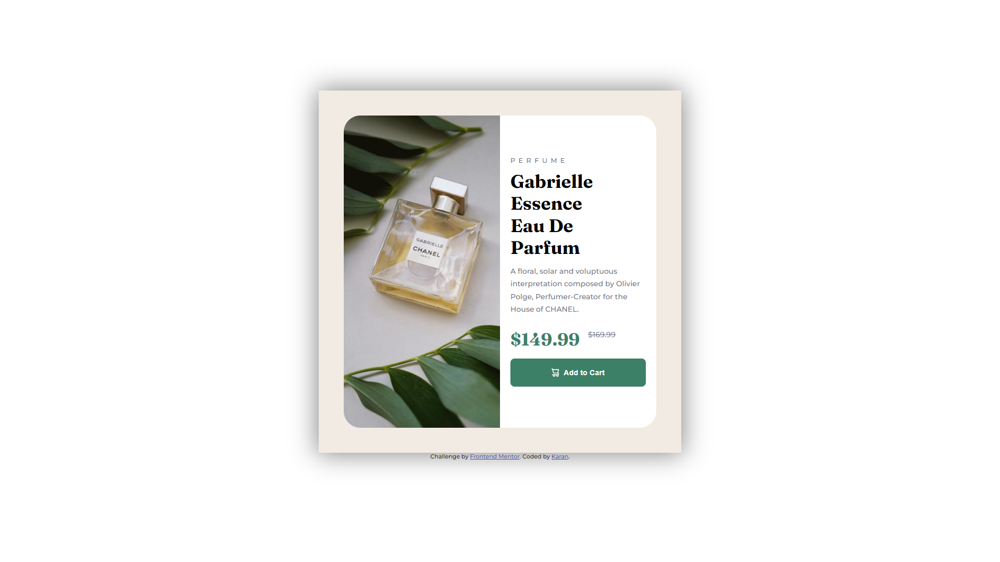

<h1 align="center">Product card</h1>

  <h3>
    <a href="https://gh0stfreak.github.io/Product-card/" color="white" target="_blank">
      Live
    </a>
   | 
        <a href="https://www.frontendmentor.io/challenges/product-preview-card-component-GO7UmttRfa" target="_blank">
      Challenge
    </a>
  </h3>

   Solution for a challenge from  <a href="https://www.frontendmentor.io/" target="_blank">frontendmentor.io</a>.

 
 
 

## About The Project

This HTML & CSS only challenge is perfect for anyone just starting out or anyone wanting a small project to play around with.
  Your users should be able to:
 1. View the optimal layout depending on their device's screen size
 2. See hover states for interactive elements

## Built with

- Semantic HTML5 markup
- CSS custom properties
- Flexbox
- Desktop-first workflow

## What I learned

This was a simple static card component.
